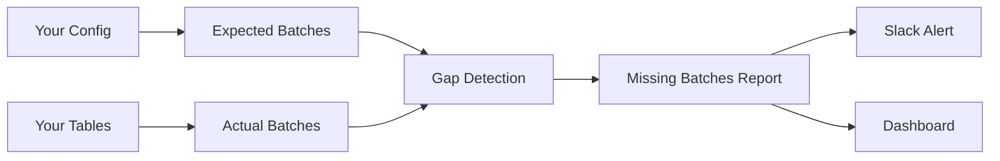

# 🎵 dbt-cadence

> **Keep your data pipelines in rhythm** - Detect missing batches before they become problems

[](https://opensource.org/licenses/Apache-2.0)
[](https://www.getdbt.com/)

---

## 🎯 The Problem

**Data pipelines are supposed to run like clockwork.** But when they break, the silence is deafening.

Your API was down for 2 hours → your hourly pipeline never noticed  
A batch arrived 3 days late → your analysis was wrong for 72 hours  
Sunday had zero orders (totally normal) → but you thought it was a bug  

**The cost:**
- 💰 Knight Capital: $440M lost in 45 minutes
- ✈️ British Airways: €100M+ when backup gaps went undetected
- 🏢 Your company: ??? (you probably don't even know yet)

---

## 💡 The Solution

**dbt-cadence** is a dbt package that:

1. 📅 **You define the rhythm** - "I expect hourly batches" or "daily batches"
2. 🔍 **We track reality** - What actually arrived in your tables
3. 🚨 **We alert on gaps** - "Batch 2025-02-08 14:00 is missing"
4. ✅ **You prevent disasters** - Before the CEO notices

### Why dbt-cadence?

| Feature | dbt-cadence | Monte Carlo | Airflow | Custom Scripts |
|---------|-------------|-------------|---------|----------------|
| **Cost** | Free | $50K-200K/year | Free | Dev time |
| **Preventive** | ✅ | ❌ Reactive | ❌ Task-level | ⚠️ Depends |
| **dbt Native** | ✅ | ❌ External | ❌ External | ❌ |
| **Setup Time** | 5 min | Days | Hours | Weeks |
| **Maintenance** | Low | Vendor | Medium | High |

---

## 🚀 Quick Start

### 1. Install
```bash
# Add to packages.yml
packages:
  - git: "https://github.com/Vanelfokamcode/dbt-cadence.git"
    revision: main

# Install
dbt deps
```

### 2. Configure

Create `seeds/cadence_config.csv`:
```csv
model_name,frequency,start_date,enabled,table_ref,timestamp_column
orders,hourly,2025-01-01,true,stg_orders,created_at
subscriptions,daily,2025-01-01,true,stg_subscriptions,created_at
```

### 3. Run
```bash
dbt seed
dbt run --select cadence
```

### 4. Check for Gaps
```sql
SELECT * FROM cadence_metadata.missing_batches
WHERE severity IN ('HIGH', 'CRITICAL')
```

**That's it.** You're now monitoring for missing batches.

---

## 📊 How It Works


**Step by step:**

1. **Expected Batches**: Generate timeline of when batches SHOULD arrive
2. **Actual Batches**: Extract timestamps from your actual data
3. **Gap Detection**: Compare expected vs actual (LEFT JOIN)
4. **Alerting**: Flag missing batches with severity (LOW/MEDIUM/HIGH/CRITICAL)

---

## 📖 Documentation

- 📘 [Architecture](docs/ARCHITECTURE.md) - How the system is designed
- 🧪 [Testing Strategy](docs/TESTING.md) - How we ensure quality
- 🛠️ [Development Setup](docs/DEVELOPMENT.md) - How to contribute
- 📚 [Full dbt Docs](http://localhost:8080) - Run `dbt docs serve`

---

## 🎨 Examples

### Monitor Hourly Event Stream
```csv
events,hourly,2025-02-01,true,stg_events,event_time
```

Detects if any hour is missing from your event stream.

### Monitor Daily ETL
```csv
daily_sales,daily,2025-01-01,true,fct_sales,sale_date
```

Alerts if a day of sales data doesn't arrive.

### Custom Alerting
```python
# Query gaps
gaps = db.query("""
    SELECT * FROM cadence_metadata.missing_batches
    WHERE severity = 'CRITICAL'
""")

# Send to Slack
for gap in gaps:
    slack.send(f"🚨 {gap.message} - {gap.model_name}")
```

---

## 🧪 Testing
```bash
# Run all tests
dbt test --select cadence

# Test specific model
dbt test --select missing_batches
```

**Test coverage:**
- ✅ Schema tests (not_null, unique, relationships)
- ✅ Data tests (no critical gaps, logical ages)
- ✅ Macro tests (correct batch counts)

---

## 🤝 Contributing

We welcome contributions!

1. Fork the repo
2. Create a feature branch (`git checkout -b feature/amazing`)
3. Make your changes
4. Run tests (`dbt test`)
5. Submit a Pull Request

See [CONTRIBUTING.md](CONTRIBUTING.md) for details.

---

## 📜 License

Apache 2.0 - See [LICENSE](LICENSE)

---

## 🙏 Acknowledgments

Standing on the shoulders of giants:
- [dbt](https://www.getdbt.com/) - The foundation
- [dbt-utils](https://github.com/dbt-labs/dbt-utils) - Package design patterns
- [dbt-expectations](https://github.com/calogica/dbt-expectations) - Testing philosophy

Inspired by the need for better data quality observability.

---

## 💬 Community

- 🐛 [Report a Bug](https://github.com/Vanelfokamcode/dbt-cadence/issues)
- 💡 [Request a Feature](https://github.com/Vanelfokamcode/dbt-cadence/issues)
- 💬 [Discussions](https://github.com/Vanelfokamcode/dbt-cadence/discussions)

---

## 🎵 Keep the rhythm.

**Because missing data shouldn't be a silent failure.**

Built with ❤️ for the data community.
